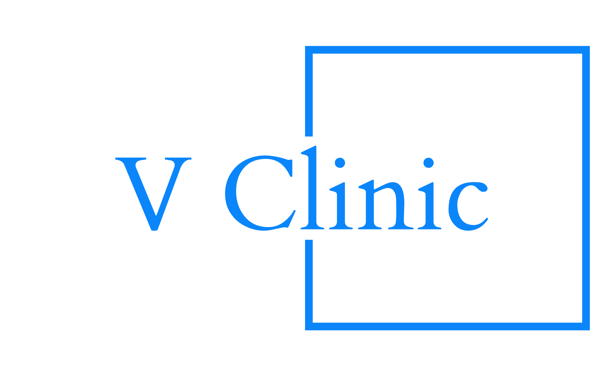

##  
### About the Project:

V-Clinic is a revolutionary virtual clinic solution designed to streamline healthcare interactions among patients, medical professionals, and clinics. Our platform aims to automate and simplify various healthcare processes, including appointment scheduling, medical record access, prescription management, and seamless communication between doctors and patients.

**Target Audience:**

Our platform caters to patients seeking convenient healthcare services, medical professionals (doctors) looking for efficient patient management tools, and clinics aiming to optimize their healthcare service offerings.

**Differentiation:**

V-Clinic stands out through its focus on providing a comprehensive healthcare solution that integrates various essential aspects of patient-doctor interactions. One of its core strengths lies in its seamless connection to a pharmacy system, facilitating streamlined prescription management and medication orders alongside doctor-patient communication, secure medical record management, and simplified appointment scheduling.

---

## Motivation

Healthcare interactions often involve various inefficiencies, from cumbersome appointment scheduling and inaccessible medical records to complex prescription management. V-Clinic is motivated by the need to address these challenges and revolutionize the healthcare industry by offering a unified platform for patients, doctors, and clinics. Our goal is to provide a seamless experience, bridging the gap between patients and healthcare providers while optimizing the healthcare journey for all stakeholders involved.

---

## Build Status

- The project is currently in active development.
- **Deployment Plan:** Scheduled deployment through AWS Services or similar platforms in the near future.
- **Initiating End-to-End Testing:** Commencing efforts to enhance End-to-End (E2E) tests, aiming for more comprehensive coverage.
- **Current Build Update:** The latest build of the project has undergone meticulous review and improvements. Sprint 3 evaluation and feedback sessions helped in correcting minor tweaks. The system now stands refined, addressing reviews, progress updates, and discounts. Additionally, the system boasts several advanced features beyond the core functionalities.

---

## Code Quality and Style Enforcement

**ESLint (Backend & Frontend):** Employed for enforcing clean, optimal, and consistent code practices in both backend and frontend development. ESLint is configured to define and enforce rules ensuring a unified code style among team members.

**Prettier:** Functions as an automated code formatter that runs before each commit, maintaining consistent and visually appealing code across the entire project. It ensures standardized code formatting for enhanced readability and consistency.

These tools, ESLint for code rule enforcement and Prettier for code formatting, collectively help maintain a high level of code quality, readability, and consistency within the project.

---

## Tech/Framework Used

The project is built on the MERN stack, which comprises the following technologies:

- **MongoDB:** A NoSQL database used for storing data in a flexible, JSON-like format.
- **Express.js:** A Node.js web application framework used for building robust APIs and web applications.
- **React:** A JavaScript library for building interactive and dynamic user interfaces.
- **Node.js:** A JavaScript runtime environment used for server-side scripting and building scalable applications.

These technologies collectively form the foundation of the project, allowing for a full-stack JavaScript-based development approach. Understanding these technologies is essential for comprehending and contributing to the project.

---

## Screenshots

---

## Features

---

## Code Examples

---

## Installation

---

## API Reference

---

## Tests

---

## How to Use?

---

## Contribute

---

## Credits

---

## License

